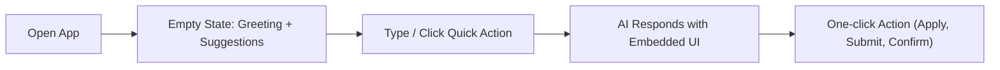

# Centriq AI — Complete UI/UX Redesign

> Transform Centriq from a functional tool into an **employee's favorite work buddy** — a visually stunning, blazing fast, and delightfully animated AI assistant.

---

## 1. Product Vision

**Centriq** is not a chatbot. It's a **friendly AI coworker** who sits right beside you, ready to handle the tedious stuff so you can focus on what matters.

| Attribute | Description |
|-----------|-------------|
| **Personality** | Helpful, proactive, slightly witty, always professional |
| **Tone** | "Hey, I noticed you haven't applied for that leave yet — want me to do it now?" |
| **Philosophy** | Every interaction should feel like talking to the smartest, most helpful colleague |
| **Speed** | 1-2 clicks max for any action; zero hunting through menus |

**Design DNA**: Microsoft Copilot's intelligence × Linear's minimalism × Notion's composability × Apple's polish

---

## 2. Branding (Derived from Logo)

The logo features a swirling cosmic/tech symbol in **violet-to-cyan gradient** on a deep dark background. This gives us:

| Token | Light Mode | Dark Mode | Usage |
|-------|-----------|-----------|-------|
| **Primary** | `#7c3aed` (Violet 600) | `#8b5cf6` (Violet 400) | Buttons, active states, brand accent |
| **Secondary** | `#6366f1` (Indigo 500) | `#818cf8` (Indigo 400) | Secondary actions, links |
| **Accent Cyan** | `#06b6d4` (Cyan 500) | `#22d3ee` (Cyan 400) | AI indicator, highlights, glow effects |
| **Accent Emerald** | `#10b981` | `#34d399` | Success states, HR domain |
| **Accent Amber** | `#f59e0b` | `#fbbf24` | Warnings, Admin domain |
| **Surface** | `#f8fafc` | `#0f172a` | Cards, elevated surfaces |
| **Background** | `#ffffff` | `#020617` | Base background |

> [!NOTE]
> The existing color system in [styles.css](file:///c:/Users/shivam.sharma/aurora-ui/src/styles.css) already aligns well with the logo. We'll enhance it with gradient tokens, glow shadows, and glassmorphism utilities.

---

## 3. UX Strategy

### Key Flows (All ≤ 2 clicks)



| Flow | Steps | Interaction |
|------|-------|-------------|
| **Ask a question** | Type → AI responds with rich card | Conversational |
| **Apply leave** | Click "Apply Leave" chip → Form appears inline → Submit | 2 clicks |
| **Raise IT ticket** | Type "need help with VPN" → AI drafts ticket → Confirm | 2 clicks |
| **Search policies** | Type query → AI returns policy excerpt + source link | 1 step |

### Design Principles
1. **Minimal Cognitive Load** — One primary action per screen state
2. **Conversational + GUI Hybrid** — Chat for discovery, embedded forms for actions
3. **Progressive Disclosure** — Show simple first, reveal complexity on demand
4. **Contextual Intelligence** — Suggest actions based on time, role, recent activity

---

## 4. Layout & Structure

```
┌─────────────────────────────────────────────────────────┐
│ [TopBar] Profile | Notifications | Search (Cmd+K)       │
├──────────┬──────────────────────────────────────────────┤
│          │                                              │
│ Sidebar  │              Main Workspace                  │
│          │  ┌──────────────────────────────────────┐    │
│ • Home   │  │         Chat Interface               │    │
│ • Chat   │  │                                      │    │
│ • Tasks  │  │    [Messages + Embedded Widgets]      │    │
│ • KB     │  │                                      │    │
│ • Settings│  │                                      │    │
│          │  ├──────────────────────────────────────┤    │
│ ──────── │  │      Quick Actions Bar               │    │
│ Recent   │  ├──────────────────────────────────────┤    │
│ Chats    │  │        Composer Input                 │    │
│          │  └──────────────────────────────────────┘    │
├──────────┴──────────────────────────────────────────────┤
│                  [Status Bar / Disclaimer]               │
└─────────────────────────────────────────────────────────┘
```

> [!IMPORTANT]
> The existing layout in [_layout.tsx](file:///c:/Users/shivam.sharma/aurora-ui/src/routes/_layout.tsx) and [Sidebar.tsx](file:///c:/Users/shivam.sharma/aurora-ui/src/components/Sidebar.tsx) already has a solid foundation. We'll **enhance** rather than rebuild, adding Framer Motion animations, a top bar, and refined styling.

---

## 5. Proposed Changes

### Phase 1: Install Framer Motion & Foundation

#### [MODIFY] [package.json](file:///c:/Users/shivam.sharma/aurora-ui/package.json)
- Add `framer-motion` dependency

#### [MODIFY] [styles.css](file:///c:/Users/shivam.sharma/aurora-ui/src/styles.css)
- Add new CSS custom properties for gradients, glow effects, glassmorphism
- Add `@keyframes` for shimmer, pulse-glow, gradient-shift
- Enhance dark mode with deeper surfaces and subtle noise texture
- Add scrollbar styling for a more premium feel

---

### Phase 2: Layout Enhancements

#### [MODIFY] [_layout.tsx](file:///c:/Users/shivam.sharma/aurora-ui/src/routes/_layout.tsx)
- Add animated top bar with search trigger (Cmd+K), notifications bell, theme toggle
- Wrap layout transitions with Framer Motion `AnimatePresence`
- Add subtle gradient mesh background that shifts colors gently

#### [MODIFY] [Sidebar.tsx](file:///c:/Users/shivam.sharma/aurora-ui/src/components/Sidebar.tsx)
- Add Framer Motion `layout` animations for collapse/expand
- Add animated nav item indicators (glowing active dot)
- Add hover micro-interactions (scale + glow)
- Refine the user section with animated role badge
- Add subtle gradient line separator between sections

---

### Phase 3: Chat Experience Redesign (Core)

#### [MODIFY] [AssistantView.tsx](file:///c:/Users/shivam.sharma/aurora-ui/src/components/assistant/AssistantView.tsx)
- Redesign empty state with animated gradient heading, staggered suggestion cards
- Add animated welcome illustration (floating particles/orbs using Framer Motion)
- Wrap message list in `AnimatePresence` for smooth enter/exit
- Add scroll-to-bottom floating button with badge count
- Add contextual header showing active conversation title

#### [MODIFY] [Message.tsx](file:///c:/Users/shivam.sharma/aurora-ui/src/components/assistant/Message.tsx)
- Add Framer Motion `motion.div` for slide-in animations on messages
- Redesign user bubble with subtle gradient background
- Redesign AI bubble with glassmorphism card, domain-colored left border accent
- Add animated avatar for AI (subtle pulse/breathe)
- Add copy/feedback toolbar with smooth reveal animation
- Improve `AnswerCard` with gradient header, animated progress indicators

#### [MODIFY] [Composer.tsx](file:///c:/Users/shivam.sharma/aurora-ui/src/components/assistant/Composer.tsx)
- Add glowing border animation on focus (gradient border that rotates)
- Add animated send button (morphs from mic to send)
- Add pill-shaped quick action chips above composer (staggered entrance)
- Redesign the attachment popover with frosted glass effect
- Add voice input visual feedback (animated waveform ring)

#### [MODIFY] [ThinkingBuddy.tsx](file:///c:/Users/shivam.sharma/aurora-ui/src/components/assistant/ThinkingBuddy.tsx)
- Enhance the SVG buddy with Framer Motion spring animations
- Add particle sparkle effects around the character
- Improve thought bubble with glassmorphism and gradient

---

### Phase 4: Smart Widget Cards

#### [NEW] [SmartWidgets.tsx](file:///c:/Users/shivam.sharma/aurora-ui/src/components/assistant/SmartWidgets.tsx)
New component with embedded dashboard-style widgets for the empty state:
- **Leave Balance Card** — Circular progress ring showing days used/remaining
- **Upcoming Holidays** — Mini timeline with colored dots
- **Pending Tasks** — Badge count with animated number transition
- **IT Ticket Status** — Status pills (Open/In Progress/Resolved) with live indicator

Each card will have:
- Glassmorphism background
- Framer Motion stagger entrance animation
- Hover lift effect with shadow expansion
- Click to expand or trigger related chat query

---

### Phase 5: Command Palette (Cmd+K)

#### [NEW] [CommandPalette.tsx](file:///c:/Users/shivam.sharma/aurora-ui/src/components/CommandPalette.tsx)
- Full-screen overlay with frosted glass backdrop
- Animated search input with icon
- Grouped results: Quick Actions, Recent Chats, Navigation, People
- Keyboard navigation with arrow keys
- Framer Motion scale-up entrance from center
- Fuzzy search across all available actions

---

### Phase 6: WOW Factors & Polish

#### [NEW] [AnimatedBackground.tsx](file:///c:/Users/shivam.sharma/aurora-ui/src/components/AnimatedBackground.tsx)
- Replace existing `AmbientBackground.tsx` with an animated mesh gradient
- Subtle floating orbs/particles in brand colors (violet, cyan, indigo)
- Responds to mouse movement slightly (parallax)
- Performance-optimized with `will-change` and GPU acceleration

#### [MODIFY] [Logo.tsx](file:///c:/Users/shivam.sharma/aurora-ui/src/components/Logo.tsx)
- Add subtle pulse glow animation on the logo
- Add breathing ring effect in brand gradient color

#### [NEW] [SkeletonLoaders.tsx](file:///c:/Users/shivam.sharma/aurora-ui/src/components/assistant/SkeletonLoaders.tsx)
- Shimmer skeleton for chat messages (3-line block with avatar)
- Shimmer skeleton for widget cards
- Smooth transition from skeleton → real content

---

## 6. Design System Tokens

### Typography Scale
| Token | Size | Weight | Usage |
|-------|------|--------|-------|
| `heading-xl` | 36px / 2.25rem | 800 | Welcome greeting |
| `heading-lg` | 24px / 1.5rem | 700 | Section titles |
| `heading-md` | 18px / 1.125rem | 600 | Card titles |
| `body` | 15px / 0.9375rem | 400 | Chat messages |
| `body-sm` | 13px / 0.8125rem | 500 | UI labels, nav items |
| `caption` | 11px / 0.6875rem | 600 | Badges, metadata |
| `mono` | 13px / 0.8125rem | 400 | Code blocks, system info |

### Spacing System (8px base)
`4px · 8px · 12px · 16px · 24px · 32px · 48px · 64px · 96px`

### Component Styles
- **Cards**: `rounded-2xl`, glassmorphism in dark mode, subtle `shadow-lg` in light mode
- **Inputs**: `rounded-[20px]`, animated gradient border on focus
- **Buttons**: `rounded-xl`, press scale `active:scale-95`, shadow on hover
- **Badges**: `rounded-full`, domain-colored with 10% opacity background

### Animation Principles (Framer Motion)
| Type | Duration | Easing | Usage |
|------|----------|--------|-------|
| **Enter** | 300-500ms | `[0.16, 1, 0.3, 1]` | Messages, cards appearing |
| **Exit** | 200ms | `[0.4, 0, 1, 1]` | Dismissing, closing |
| **Hover** | 150ms | `easeOut` | Scale, shadow changes |
| **Stagger** | 50-80ms | — | List items, widget grid |
| **Spring** | `{ stiffness: 300, damping: 30 }` | spring | Layout animations, morphing |

---

## 7. React Component Architecture

### Updated Folder Structure
```
src/
├── components/
│   ├── assistant/
│   │   ├── AssistantView.tsx      ← [MODIFY] Main chat view
│   │   ├── Composer.tsx           ← [MODIFY] Input with animations
│   │   ├── Message.tsx            ← [MODIFY] Chat bubbles
│   │   ├── ThinkingBuddy.tsx      ← [MODIFY] AI thinking animation
│   │   ├── SmartWidgets.tsx       ← [NEW] Dashboard widget cards
│   │   ├── SkeletonLoaders.tsx    ← [NEW] Shimmer loading states
│   │   ├── QuickActions.tsx       ← [MODIFY] Redesigned action chips
│   │   ├── SuggestionChips.tsx    ← [MODIFY] Animated suggestion pills
│   │   ├── SuggestionsBar.tsx     ← [MODIFY] Category filter bar
│   │   ├── ParkingForm.tsx        ← Existing (minor polish)
│   │   ├── InteractiveEmailDraft  ← Existing (minor polish)
│   │   └── AnnouncementBanner.tsx ← Existing (minor polish)
│   ├── ui/                        ← shadcn/ui primitives (unchanged)
│   ├── AnimatedBackground.tsx     ← [NEW] Mesh gradient + particles
│   ├── CommandPalette.tsx         ← [NEW] Cmd+K palette
│   ├── Sidebar.tsx                ← [MODIFY] With Framer Motion
│   ├── Logo.tsx                   ← [MODIFY] Animated glow
│   ├── BrandName.tsx              ← Existing (unchanged)
│   ├── ThemeToggle.tsx            ← Existing (minor polish)
│   └── NotFound.tsx               ← Existing (unchanged)
├── hooks/
│   ├── use-mobile.tsx             ← Existing
│   └── use-theme.tsx              ← Existing
├── lib/
│   ├── chat-store.ts              ← Existing (unchanged)
│   ├── auth-store.tsx             ← Existing (unchanged)
│   ├── settings-store.ts          ← Existing (unchanged)
│   └── utils.ts                   ← Existing (unchanged)
├── routes/                        ← Existing (minimal changes)
└── styles.css                     ← [MODIFY] Enhanced design tokens
```

---

## 8. Key Code Patterns

### Framer Motion Message Animation
```tsx
import { motion, AnimatePresence } from "framer-motion";

// In message list:
<AnimatePresence mode="popLayout">
  {messages.map((msg, i) => (
    <motion.div
      key={msg.id}
      initial={{ opacity: 0, y: 20, scale: 0.95 }}
      animate={{ opacity: 1, y: 0, scale: 1 }}
      exit={{ opacity: 0, scale: 0.95 }}
      transition={{ type: "spring", stiffness: 300, damping: 30 }}
    >
      {msg.role === "user" ? <UserMessage /> : <AIMessage />}
    </motion.div>
  ))}
</AnimatePresence>
```

### Animated Gradient Border (Composer)
```tsx
<motion.div
  className="relative rounded-[24px] p-[1px]"
  animate={{
    background: isFocused
      ? "linear-gradient(135deg, #7c3aed, #06b6d4, #8b5cf6, #22d3ee)"
      : "transparent",
    backgroundSize: "300% 300%",
  }}
  transition={{ duration: 2, repeat: Infinity }}
>
  <div className="rounded-[23px] bg-card/95 backdrop-blur-xl">
    {/* textarea + controls */}
  </div>
</motion.div>
```

### Smart Widget Card
```tsx
<motion.div
  whileHover={{ y: -4, boxShadow: "0 20px 60px -15px rgba(124,58,237,0.25)" }}
  className="glass-card rounded-2xl p-5 cursor-pointer"
>
  <div className="flex items-center justify-between">
    <h3 className="text-sm font-bold">Leave Balance</h3>
    <CircularProgress value={75} />
  </div>
  <p className="text-2xl font-black text-primary mt-2">12 days</p>
  <p className="text-xs text-muted-foreground">remaining this year</p>
</motion.div>
```

---

## 9. Open Questions

> [!IMPORTANT]
> **Framer Motion Installation**: The project currently uses CSS animations. Adding `framer-motion` (~32KB gzipped) is the recommended approach for the animation quality requested. Should I proceed with installing it, or would you prefer to stick with pure CSS animations?

> [!IMPORTANT]  
> **Scope Prioritization**: This is a large redesign. Would you like me to:
> - **Option A**: Implement everything in one go (all 6 phases)
> - **Option B**: Start with Phases 1-3 (foundation + chat redesign) and iterate
> - **Option C**: Focus on specific areas you care most about

> [!NOTE]
> **Command Palette**: The app already has `cmdk` (command menu library) installed in [package.json](file:///c:/Users/shivam.sharma/aurora-ui/package.json#L54). We can leverage it for the Cmd+K palette without additional dependencies.

> [!NOTE]
> **Tailwind CSS Version**: The project uses Tailwind CSS v4 with the `@tailwindcss/vite` plugin and `@theme inline` syntax. All styling changes will conform to this v4 pattern.

---

## 10. Verification Plan

### Automated Tests
- `npm run build` — Ensure zero TypeScript/build errors after changes
- Visual regression: Verify all routes render correctly (`/`, `/settings`, `/config`, `/admin`, `/hr-portal`, `/it-portal`, `/admin-portal`)

### Manual Verification
- Run `npm run dev` and verify:
  - [ ] Dark/light theme switching works correctly
  - [ ] Sidebar collapse/expand animates smoothly
  - [ ] Chat messages animate in with slide-up effect
  - [ ] Composer focus triggers gradient border glow
  - [ ] ThinkingBuddy animation is smooth and performant
  - [ ] Smart widgets render on empty state
  - [ ] Command palette opens with Cmd+K / Ctrl+K
  - [ ] Mobile responsive layout works correctly
  - [ ] All existing functionality (send message, feedback, file upload, voice) continues to work

### Performance
- Framer Motion animations should maintain 60fps
- No layout shift on page load
- Lazy load command palette component

---

## 11. Design References

| Inspiration | What We Take |
|-------------|-------------|
| **Microsoft Copilot** | Chat + embedded action cards, domain routing badges |
| **Linear.app** | Minimalist dark UI, keyboard-first navigation, Cmd+K palette |
| **Notion AI** | Inline content generation, progressive disclosure |
| **Slack AI** | Contextual suggestions, threaded conversations |
| **Apple Human Interface** | Typography scale, animation physics, glassmorphism |

