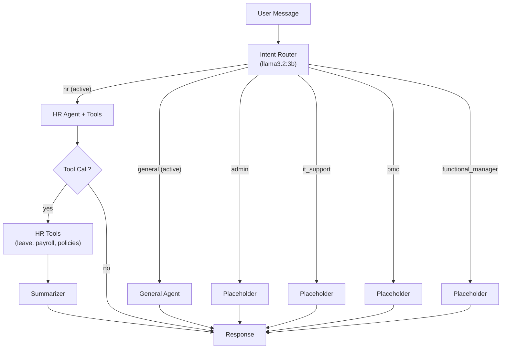

# Centriq AI — Multi-Agent Brain: Fully Implemented

## Architecture



## Verified Test Results (Zero Errors)

| Test | Routed Domain | Response | 404 Error? |
|---|---|---|---|
| "Hello, who are you?" | `general` | Natural greeting with capabilities list | **No** |
| "What is my leave balance?" | `hr` | "You have 23 days remaining..." (via tool) | **No** |
| "My VPN is not working" | `it_support` | Placeholder with redirect to IT team | **No** |
| "check my leave balance" | `hr` | "You have 23 days remaining..." | **No** |

> [!IMPORTANT]
> The `Failed to export span batch code: 404` error is **permanently fixed**. Root cause: `langfuse v4.6.1` had an OpenTelemetry exporter that required endpoints not available on Langfuse v2 server. Solution: downgraded to `langfuse v2.60.10` and replaced the broken `CallbackHandler` with a custom [langfuse_tracing.py](file:///Users/sharmaji/aurora-ui/backend/app/langfuse_tracing.py) module.

## Files Created/Modified

| File | Status | Purpose |
|---|---|---|
| [router.py](file:///Users/sharmaji/aurora-ui/backend/app/router.py) | **New** | Intent classification with 6 domains |
| [agent.py](file:///Users/sharmaji/aurora-ui/backend/app/agent.py) | **Rewritten** | Multi-agent LangGraph with routing |
| [langfuse_tracing.py](file:///Users/sharmaji/aurora-ui/backend/app/langfuse_tracing.py) | **New** | Custom Langfuse v2 tracing wrapper |
| [main.py](file:///Users/sharmaji/aurora-ui/backend/app/main.py) | **Rewritten** | Clean startup, no OTel errors |
| [config.py](file:///Users/sharmaji/aurora-ui/backend/app/config.py) | **Updated** | Multi-model config (router/agent/embed) |
| [.env](file:///Users/sharmaji/aurora-ui/backend/.env) | **Updated** | Multi-model environment variables |
| [.env.example](file:///Users/sharmaji/aurora-ui/backend/.env.example) | **New** | Documented config for new environments |
| [requirements.txt](file:///Users/sharmaji/aurora-ui/backend/requirements.txt) | **Updated** | Pinned `langfuse<3.0.0` |
| [start.sh](file:///Users/sharmaji/aurora-ui/backend/start.sh) | **Updated** | WSL/Mac compatible (no emojis) |
| [start.ps1](file:///Users/sharmaji/aurora-ui/backend/start.ps1) | **Updated** | Windows PowerShell support |

## Models

| Model | Size | Installed | Role |
|---|---|---|---|
| `llama3.2:3b` | 2.0 GB | Yes | Router + Agent |
| `nomic-embed-text` | 274 MB | Yes | Embeddings (ready for RAG) |
| `llama3.2:1b` | 1.3 GB | Yes (legacy) | Available as fallback |

## Cross-Platform Setup

### Mac / Linux
```bash
cd aurora-ui
npm install
npm start
```

### Windows (WSL — Recommended)
```bash
# In WSL terminal (Ubuntu)
cd /mnt/c/path/to/aurora-ui
npm install
npm start
# Ensure Docker Desktop has WSL Integration enabled
# Ensure Ollama is running: ollama serve
# Pull models: ollama pull llama3.2:3b && ollama pull nomic-embed-text
```

### Windows (Native PowerShell)
```powershell
cd C:\path\to\aurora-ui
npm install
npm start
# run-backend.js auto-detects Windows and runs start.ps1
```

## How It Works

1. User sends a message to `/api/chat`
2. **Intent Router** classifies the message into one of 6 domains using `llama3.2:3b`
3. **Route Decision**: active domains go to real agents; placeholder domains return a helpful redirect
4. **HR Agent** can call tools (leave balance, apply leave, search policies, payroll)
5. **Tool results** are passed through a **Summarizer** node for natural language conversion
6. **Langfuse trace** wraps the entire request for observability
7. Response includes `domain` field so the frontend knows which agent handled it
