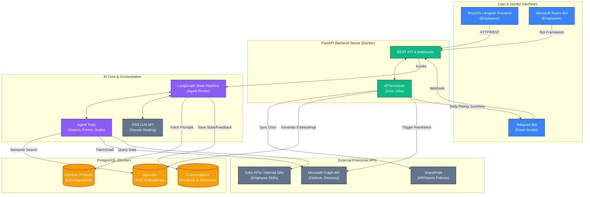

# High-Level Architecture Diagram

This diagram outlines the complete architecture of the Nexus AI Assistant, detailing the frontend interfaces, the FastAPI backend, the LangGraph orchestration, database storage, and external enterprise integrations.

## Key Workflows

1. **User Chat & RAG**: User sends a message via React UI or Teams. The FastAPI server passes it to LangGraph. LangGraph pulls the system prompt from PostgreSQL, checks if the query requires external knowledge, queries the `pgvector` database for policies, and synthesizes an answer using the OSS LLM.
2. **Food Vendor Update**: Vendor sends a message on Telegram. Telegram hits our FastAPI Webhook. The backend updates the internal state for the day's menu.
3. **Automated Document Sync**: The Cron Job (APScheduler) wakes up daily, connects to SharePoint via MS Graph, downloads new HR/Admin policies, chunks them, creates embeddings using the LLM API, and saves them to PostgreSQL (`pgvector`).
4. **Email Drafting / Reminders**: The Agent uses MS Graph tools to locate a reporting manager and save an email draft. Alternatively, the Cron Job finds unpaid parking fees in PostgreSQL and automatically emails reminders at the end of the month.
