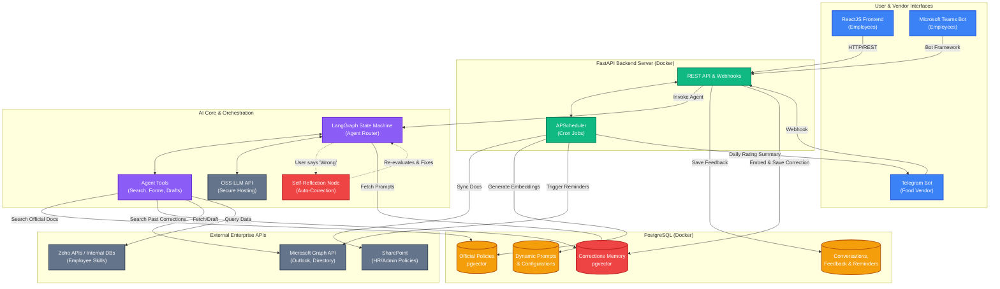

# Comprehensive Auto-Learning Architecture

This diagram combines the entire baseline system architecture (Frontend, Teams, Telegram, Integrations, Cron Jobs) with the advanced **Self-Learning Loop**. 

The auto-learning components are highlighted in red, specifically the **Corrections Memory DB** and the **Self-Reflection Node**. This allows you to evaluate the full scope of the system if you choose to implement auto-learning.

## How the Unified System Works

### 1. Standard Interactions
- Employees use React or Teams to ask questions.
- The `FastAPI` server routes this to `LangGraph`.
- `LangGraph` fetches instructions from the `ConfigDB` and uses `Tools` to query `SharePoint` policies in `VectorDB` or check `Zoho` data.
- The `OSS LLM` synthesizes the final answer.

### 2. Auto-Learning Path (Highlighted in Red)
- **Ingestion**: If an employee clicks Thumbs Down and leaves a correction, `FastAPI` embeds that correction directly into the `CorrectionsDB`.
- **Dual-Retrieval**: On future queries, `LangGraph Tools` will automatically perform a semantic search on **both** the `Official Policies DB` and the `CorrectionsDB`.
- **Self-Reflection**: If an employee corrects the bot mid-conversation, `LangGraph` triggers the `Self-Reflection Node`, enabling it to immediately search for the right answer and correct itself live.

### 3. Background Automation
- `APScheduler` works tirelessly in the background: fetching new SharePoint documents, emailing unpaid parking sticker reminders via MS Graph, and pushing the daily food ratings to the vendor via Telegram.
